# MerRec — Dàn ý 38 slide chính + 2 trang demo riêng

Trích từ notebook, CSV, JSON và PNG có trong dự án. Không chạy lại EDA hoặc training.

**Phạm vi:** dữ liệu, xử lý, EDA, đặc trưng, mô hình và kết quả. Demo ở phụ lục 39–40. Theo xác nhận của người dùng, SASRec, DCN và LightGBM Ranker chưa có kết quả để báo cáo; không sử dụng metric SASRec cũ.

**Thiết kế:** 16:9, nền trắng, xanh #244BFF, mỗi slide 3–4 ý, nội dung 22–26 pt, ảnh khoảng 55–70%. Ghi chú thuyết trình đưa vào speaker notes. Chỉ các nhãn thiết yếu về protocol/mẫu phải hiện trên slide kết quả.

**Dùng với Canva:** giải nén → tải ảnh trong images lên Canva → dùng tên file tương ứng ở từng slide. Prompt văn bản không tự đọc ảnh trên máy; bạn cần tải ảnh lên. Ảnh web để khung trống cho ảnh chụp sau.

**Nguồn ảnh:** 14 ảnh EDA gốc từ kernel_1752 và 8 ảnh vẽ từ bảng tổng hợp/history. danh_muc_anh.csv ghi nguồn, slide, lưu ý và SHA256. Histogram user/item/session dùng mẫu 100.000; số liệu tóm tắt lấy từ bảng tổng hợp toàn bộ. Biểu đồ event được vẽ lại theo mapping preprocessing chính xác.

**Đánh giá:** các mô hình có tập user, candidate universe và protocol khác nhau; kết quả là bản ghi từng thực nghiệm, không phải leaderboard. GRU4Rec chỉ trình bày sampled validation. Chưa chạy lại kiểm chứng model hoặc ứng dụng web trong công việc chuẩn bị slide.

## Slide 01 — MerRec — Gợi ý sản phẩm từ dữ liệu hành vi

**Phần:** Mở đầu

**Nội dung lên slide:**

- Phân tích dữ liệu tháng 05/2023, xây dựng đặc trưng và thực nghiệm mô hình gợi ý.
- Trọng tâm: dữ liệu lớn, implicit feedback, cold-start và đánh giá Top-K.
- Chèn tên nhóm, thành viên và giảng viên khi thiết kế.

**Bố cục / hình:** Bìa 16:9; tiêu đề trái, sơ đồ Dữ liệu → Mô hình → Gợi ý bên phải.

**Nguồn:** `training/00_eda.ipynb`; `training/01_preprocess.ipynb`

---

## Slide 02 — Nội dung trình bày

**Phần:** Mở đầu

**Nội dung lên slide:**

- 01 Introduction · 02 Problem Definition · 03 Dataset Description.
- 04 Data Preprocessing · 05 EDA · 06 Feature Engineering.
- 07 Models · 08 Model Training · 09 Results · 11 Conclusion.
- 10 Web Application / Demo tách riêng ở phụ lục 39–40.

**Bố cục / hình:** Mục lục hai cột, số thứ tự trong hình tròn xanh; demo đặt trong ô nhỏ cuối trang.

**Ghi chú thuyết trình:** Giữ đủ 11 phần người dùng yêu cầu, nhưng đưa Web Application ra sau phần kết luận.

---

## Slide 03 — Bối cảnh và thực trạng thương mại điện tử

**Phần:** 01 Introduction

**Nội dung lên slide:**

- Theo Bộ Công Thương, quy mô TMĐT Việt Nam năm 2024 vượt 25 tỷ USD, tăng 20% so với năm 2023.
- Catalog đa dạng đặt ra bài toán giúp người mua khám phá sản phẩm phù hợp.
- Trong bài toán C2C, dữ liệu hành vi và thuộc tính item là nguồn tín hiệu cho gợi ý.
- Đề tài dùng MerRec từ Mercari để thực nghiệm; không dùng dữ liệu thị trường Việt Nam để huấn luyện.

**Bố cục / hình:** Hai thẻ >25 tỷ USD và +20%, ghi rõ năm 2024; bên dưới là liên hệ tới bài toán khám phá sản phẩm.

**Ghi chú thuyết trình:** Số liệu Việt Nam chỉ là bối cảnh năm 2024, không phải thống kê năm hiện tại. Nhu cầu khám phá sản phẩm là động lực thiết kế, không phải kết quả khảo sát người dùng của đồ án. Nguồn Bộ Công Thương đăng ngày 18/02/2025.

**Nguồn:** `https://moit.gov.vn/khoa-hoc-va-cong-nghe/thuong-mai-dien-tu-viet-nam-nam-2024-nhung-buoc-tien-va-thach-thuc.html`; `https://arxiv.org/abs/2402.14230`

---

## Slide 04 — Vấn đề thực tiễn: tìm sản phẩm nào giữa catalog lớn?

**Phần:** 01 Introduction

**Nội dung lên slide:**

- Người mua cần thu hẹp lựa chọn và tìm item phù hợp với mối quan tâm.
- Tìm kiếm theo từ khóa cần người dùng diễn đạt được nhu cầu; danh sách phổ biến không tự phản ánh sở thích riêng.
- Dữ liệu dự án có 30,05 triệu item nhưng 71,17% item có dưới 5 tương tác.
- 84,55% sự kiện là view: cần khai thác cả lịch sử hành vi thay vì chỉ chờ tín hiệu mua.

**Bố cục / hình:** Hai cột: khó khăn khi khám phá sản phẩm và bằng chứng trong MerRec; kết luận nhu cầu gợi ý dựa trên dữ liệu.

**Ghi chú thuyết trình:** Các hạn chế của tìm kiếm/phổ biến là phân tích thiết kế phương pháp; không khẳng định tất cả sàn thương mại điện tử đang hoạt động như vậy. Không suy ra conversion từ tỷ lệ event.

**Nguồn:** `data/processed/eda_merrec_may/kernel_1752/tables/02_overview.csv`; `data/processed/eda_merrec_may/kernel_1752/tables/06_cold_items.csv`; `data/processed/recommender/tables/01_event_mapping.csv`

---

## Slide 05 — Lý do chọn đề tài

**Phần:** 01 Introduction

**Nội dung lên slide:**

- Tính thực tiễn: hỗ trợ khám phá sản phẩm dựa trên nhu cầu và lịch sử người dùng.
- Tính học thuật: nghiên cứu implicit feedback, long-tail, cold-start và dữ liệu tuần tự trong C2C.
- Tính khả thi: MerRec có timestamp, nhiều hành vi và metadata để xây dựng thực nghiệm.
- Tính ứng dụng: kết nối quy trình dữ liệu, mô hình gợi ý và giao diện minh họa.

**Bố cục / hình:** Bốn thẻ lý do: Thực tiễn · Học thuật · Dữ liệu phù hợp · Khả năng ứng dụng.

**Ghi chú thuyết trình:** Đây là lý do lựa chọn và giá trị kỳ vọng của đề tài, không phải tuyên bố đồ án đã tăng doanh thu, giảm thời gian tìm kiếm hoặc hoàn tất tích hợp model.

**Nguồn:** `https://arxiv.org/abs/2402.14230`; `training/00_eda.ipynb`; `training/01_preprocess.ipynb`

---

## Slide 06 — Mục tiêu, ý nghĩa và phạm vi nghiên cứu

**Phần:** 01 Introduction

**Nội dung lên slide:**

- Mục tiêu tổng quát: xây dựng và đánh giá phương pháp gợi ý Top-K trên dữ liệu hành vi MerRec.
- Mục tiêu cụ thể: xử lý dữ liệu, EDA, tạo đặc trưng và thực nghiệm nhiều hướng mô hình.
- Ý nghĩa: hiểu tác động của dữ liệu thưa, cold-start và giao thức đánh giá tới chất lượng gợi ý.
- Phạm vi: lát dữ liệu tháng 05/2023, đánh giá offline; demo web tách riêng.

**Bố cục / hình:** Mục tiêu tổng quát ở dải đầu; ba khối Công việc · Ý nghĩa · Phạm vi bên dưới.

**Ghi chú thuyết trình:** Không khẳng định ưu thế mô hình khi các thực nghiệm chưa thống nhất protocol. SASRec, DCN và LightGBM chưa hoàn tất; chưa có kiểm chứng hiệu quả kinh doanh hoặc A/B test.

**Nguồn:** `training/00_eda.ipynb`; `training/01_preprocess.ipynb`; `training/models`

---

## Slide 07 — Bài toán gợi ý và các thách thức

**Phần:** 02 Problem Definition

**Nội dung lên slide:**

- Đầu vào: lịch sử user, loại hành vi và metadata; đầu ra: danh sách Top-K item.
- Hai hướng nghiên cứu: truy hồi theo sở thích/nội dung và dự đoán item tiếp theo.
- Độ thưa user–item khoảng 99,999843%; 32,75% dòng TEST chứa cold item.
- Đánh giá Recall, HitRate, NDCG; chú ý coverage, tập user và candidate universe.

**Bố cục / hình:** Sơ đồ Đầu vào → Mô hình → Top-K ở trên; hai số liệu thách thức và nhóm metric ở dưới.

**Ghi chú thuyết trình:** Gộp phát biểu bài toán và thách thức để dành thêm chỗ cho lý do chọn đề tài, giữ tổng 40 trang.

**Nguồn:** `training/models/04_gru4rec.ipynb`; `training/models/05_two_tower.ipynb`; `data/processed/eda_merrec_may/kernel_1752/tables/12_matrix_sparsity.csv`; `data/processed/recommender/tables/03_cold_start_summary.csv`

---

## Slide 08 — MerRec: quy mô và cấu trúc dữ liệu

**Phần:** 03 Dataset Description

**Nội dung lên slide:**

- 312 file Parquet, khoảng 21,57 GB; 174.872.167 tương tác trong lát dữ liệu tháng 05/2023.
- 2.765.863 user; 30.054.040 item_id; 913.718 product_id duy nhất.
- Các nhóm trường: định danh; event/timestamp/session; tên, giá, category và thuộc tính item.
- Nguồn là nền tảng C2C Mercari; session EDA dùng cặp (user_id, session_id).

**Bố cục / hình:** Ba thẻ số liệu phía trên; bảng ba nhóm trường ở dưới; nguồn và phạm vi ở chân trang.

**Ghi chú thuyết trình:** Dataset gốc trong bài báo bao phủ 6 tháng năm 2023; đồ án chỉ dùng lát tháng 05. Phân biệt item_id và product_id. 4.196.977 session_id khác 34.832.704 cặp (user_id, session_id).

**Nguồn:** `https://arxiv.org/abs/2402.14230`; `data/processed/eda_merrec_may/kernel_1752/tables/01_structure_summary.csv`; `data/processed/eda_merrec_may/kernel_1752/tables/02_overview.csv`; `data/processed/eda_merrec_may/kernel_1752/tables/01_union_schema.csv`

---

## Slide 09 — Sáu loại hành vi

**Phần:** 03 Dataset Description

**Nội dung lên slide:**

- item_view → view; item_like → like.
- item_add_to_cart_tap → cart; offer_make → offer.
- buy_start → bắt đầu mua; buy_comp → hoàn tất mua.
- Đây là implicit feedback, không phải điểm rating.

**Bố cục / hình:** Bảng tên gốc → tên chuẩn → ý nghĩa; không vẽ thành funnel bắt buộc.

**Nguồn:** `data/processed/recommender/tables/01_event_mapping.csv`

---

## Slide 10 — Pipeline tiền xử lý

**Phần:** 04 Data Preprocessing

**Nội dung lên slide:**

- Parquet → DuckDB raw view → chuẩn hóa ID, timestamp, event và metadata.
- Lọc bản ghi không hợp lệ → khử trùng → chia theo thời gian.
- Xuất interactions, train-only ID maps, catalog và implicit-feedback pairs.
- Tạo popularity/trending và các cohort cold-start.

**Bố cục / hình:** Sơ đồ ngang 6 bước; mỗi bước tối đa một dòng.

**Ghi chú thuyết trình:** DuckDB VIEW và xử lý theo batch tránh nạp toàn bộ raw vào Pandas.

**Nguồn:** `training/01_preprocess.ipynb`

---

## Slide 11 — Làm sạch và khử trùng

**Phần:** 04 Data Preprocessing

**Nội dung lên slide:**

- Chuẩn hóa ID thành chuỗi; trim; đọc timestamp theo kiểu dữ liệu nguồn.
- Lọc thiếu user_id/item_id/timestamp và event không hỗ trợ.
- Khóa khử trùng: user, item, event, timestamp, session và sequence.
- 174.872.167 → 174.725.659 dòng; tổng giảm 146.508 dòng.

**Bố cục / hình:** Hai số lớn trước/sau và hộp chứa khóa khử trùng.

**Ghi chú thuyết trình:** 146.508 là chênh lệch raw và tổng split đã lưu. Không thay bằng 152.779 từ chẩn đoán duplicate-key EDA vì khóa khác nhau.

**Nguồn:** `training/01_preprocess.ipynb`; `data/processed/recommender/tables/02_split_summary.csv`

---

## Slide 12 — Xử lý metadata thiếu

**Phần:** 04 Data Preprocessing

**Nội dung lên slide:**

- Color thiếu 95,61%; size_name 62,74%; brand_name 19,20%.
- Danh mục thiếu lấy cấp cha; brand/condition/shipper dùng __UNK__.
- Size giữ NULL lúc chuẩn hóa; color không xuất vào interactions train/val/test.
- Giữ lại hành vi hữu ích khi chỉ thiếu metadata tùy chọn.

**Bố cục / hình:** Ảnh 60% bên phải, quy tắc xử lý bên trái.

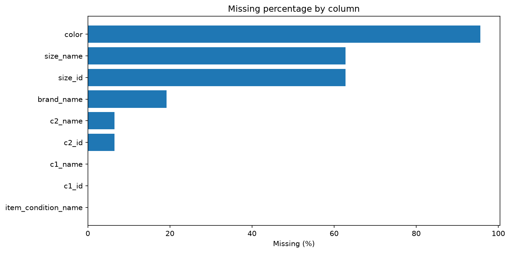

Ảnh: [images/03_missing_percentage.png](images/03_missing_percentage.png)

**Ghi chú thuyết trình:** Tỷ lệ thiếu tính theo dòng tương tác. Không suy ra mọi field đều đã xuất vào serving catalog.

**Nguồn:** `data/processed/eda_merrec_may/kernel_1752/tables/03_missing.csv`; `training/01_preprocess.ipynb`

---

## Slide 13 — Chia TRAIN / VAL / TEST theo thời gian

**Phần:** 04 Data Preprocessing

**Nội dung lên slide:**

- TRAIN 01–25/05: 145.998.253 tương tác.
- VAL 26–28/05: 16.885.121 tương tác.
- TEST 29–31/05: 11.842.285 tương tác; kết thúc 31/05 lúc 00:00:00.
- Integrity đã lưu: TRAIN trước VAL, VAL trước TEST.

**Bố cục / hình:** Timeline/số lượng ngang lớn với nhãn ngày.

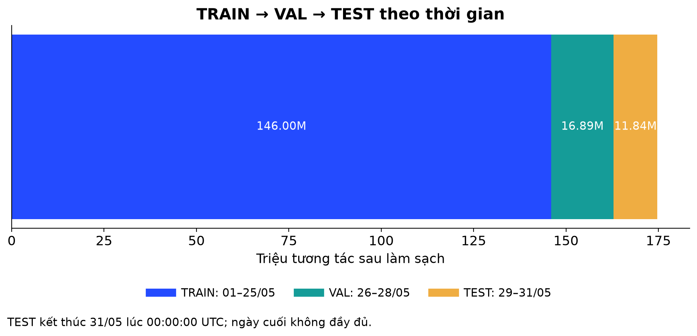

Ảnh: [images/s13_temporal_split.png](images/s13_temporal_split.png)

**Ghi chú thuyết trình:** Ngày cuối không đầy đủ. Split đúng thứ tự chưa chứng minh mọi khâu metadata/mô hình đều không leakage.

**Nguồn:** `data/processed/recommender/tables/02_split_summary.csv`; `data/processed/recommender/tables/09_split_integrity.csv`

---

## Slide 14 — ID mapping và cold-start

**Phần:** 04 Data Preprocessing

**Nội dung lên slide:**

- Mapping từ TRAIN: 2.581.378 user; 27.328.461 item.
- TEST cold-user 6,35%; cold-item 32,75%; cả hai cold 1,64% số dòng.
- Tách cohort warm, cold-user, cold-item và cold-both.
- Cần phương án fallback cho trường hợp thiếu lịch sử.

**Bố cục / hình:** Biểu đồ nhóm cột và câu kết luận dưới ảnh.

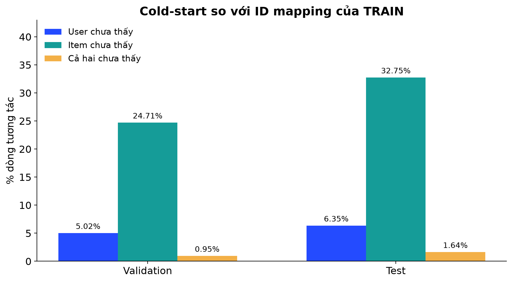

Ảnh: [images/s14_cold_start.png](images/s14_cold_start.png)

**Ghi chú thuyết trình:** Cold-user và cold-item trong biểu đồ có giao nhau; không cộng ba cột thành tổng.

**Nguồn:** `data/processed/recommender/tables/03_cold_start_summary.csv`; `data/processed/recommender/tables/04_cf_train_summary.csv`

---

## Slide 15 — EDA: mất cân bằng hành vi

**Phần:** 05 Exploratory Data Analysis

**Nội dung lên slide:**

- View 84,551%; like 12,736%; cart 1,656%.
- Offer 0,700%; buy_start 0,247%; buy_comp 0,109%.
- Tín hiệu mua hoàn tất rất hiếm so với lượt xem.
- Cần khai thác nhiều hành vi và báo cáo target mua hàng riêng.

**Bố cục / hình:** Biểu đồ ngang chiếm 70%; ba ý diễn giải ngắn.

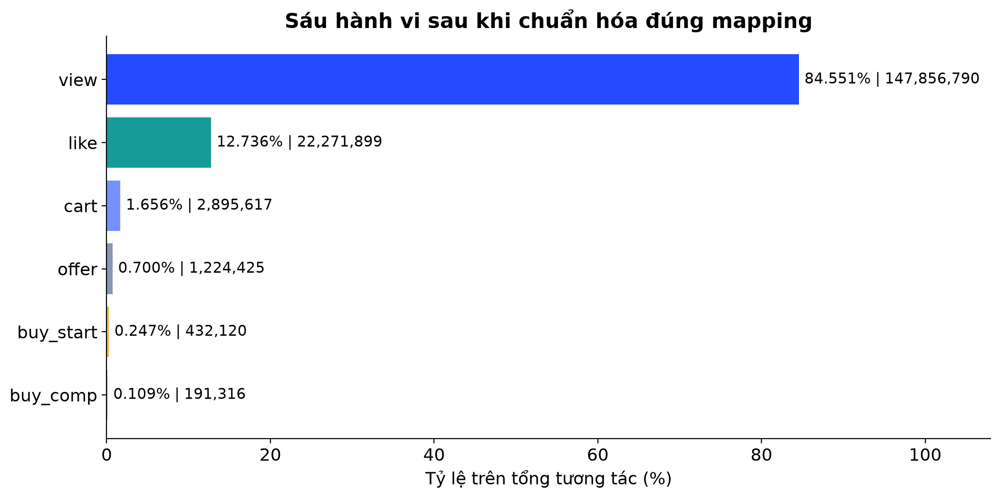

Ảnh: [images/s15_event_mapping_corrected.png](images/s15_event_mapping_corrected.png)

**Ghi chú thuyết trình:** Ảnh vẽ lại theo mapping đúng của preprocessing. Tỷ lệ đếm hành vi không phải conversion rate; không dùng funnel cũ có cart=0.

**Nguồn:** `data/processed/recommender/tables/01_event_mapping.csv`

---

## Slide 16 — EDA: người dùng có phân bố dài đuôi

**Phần:** 05 Exploratory Data Analysis

**Nội dung lên slide:**

- Trung bình 63,23 tương tác/user nhưng trung vị chỉ 12.
- P95=275; P99=791; cực đại=29.597.
- 13,31% user có đúng một tương tác; 31,36% có dưới 5.
- Cần xử lý cả ít lịch sử và hoạt động rất mạnh.

**Bố cục / hình:** Histogram log bên phải; hai thẻ mean/median bên trái.

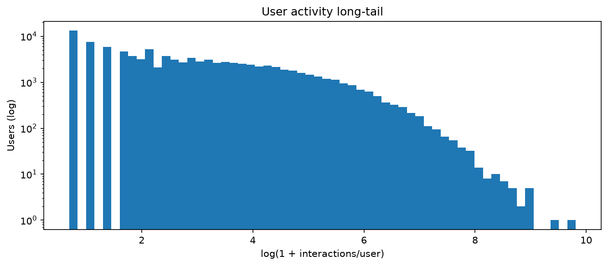

Ảnh: [images/05_user_interactions_log.png](images/05_user_interactions_log.png)

**Ghi chú thuyết trình:** Ảnh histogram dùng mẫu 100.000 user. Thống kê tóm tắt tính trên toàn bộ user.

**Nguồn:** `data/processed/eda_merrec_may/kernel_1752/tables/05_user_summary.csv`; `data/processed/eda_merrec_may/kernel_1752/tables/05_user_thresholds.csv`

---

## Slide 17 — EDA: long-tail của sản phẩm

**Phần:** 05 Exploratory Data Analysis

**Nội dung lên slide:**

- Trung vị 2 tương tác/item; trung bình 5,82.
- 38,80% item có dưới 2 tương tác; 71,17% có dưới 5.
- 85,59% item có dưới 10 tương tác.
- Cần quan tâm tới item ít dữ liệu, không chỉ item phổ biến.

**Bố cục / hình:** Hai ảnh cạnh nhau: histogram log và Pareto.

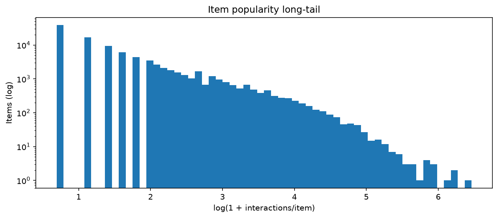

Ảnh: [images/06_item_interactions_log.png](images/06_item_interactions_log.png)

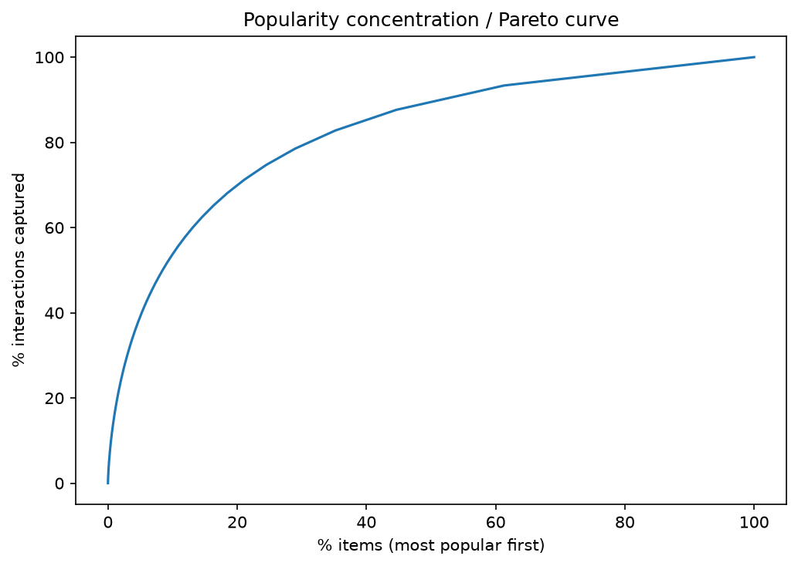

Ảnh: [images/06_popularity_pareto.png](images/06_popularity_pareto.png)

**Ghi chú thuyết trình:** Histogram dùng mẫu 100.000 item. Không tự kết luận quy luật 80/20 hoặc dùng view_only_items từ mapping EDA cũ.

**Nguồn:** `data/processed/eda_merrec_may/kernel_1752/tables/06_item_summary.csv`; `data/processed/eda_merrec_may/kernel_1752/tables/06_cold_items.csv`

---

## Slide 18 — EDA: các phiên tương tác thường ngắn

**Phần:** 05 Exploratory Data Analysis

**Nội dung lên slide:**

- 34.832.704 session theo cặp (user_id, session_id).
- Trung vị 2 tương tác; P95=18; P99=39.
- Trung vị thời lượng 37 giây; P95=890 giây.
- Hành vi gần nhất là nguồn ngữ cảnh đáng thử nghiệm.

**Bố cục / hình:** Hai ảnh session length/duration.

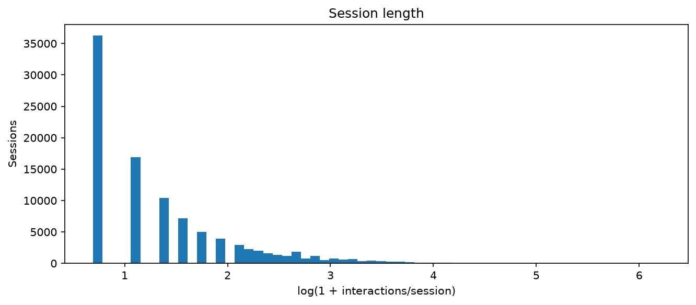

Ảnh: [images/07_session_length.png](images/07_session_length.png)

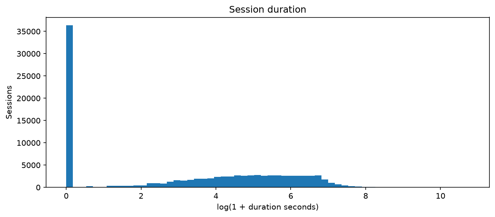

Ảnh: [images/07_session_duration.png](images/07_session_duration.png)

**Ghi chú thuyết trình:** Histogram dùng mẫu 100.000 session. Không dùng pct_has_cart=0 từ EDA cũ. EDA không tự chứng minh mô hình chuỗi tốt hơn.

**Nguồn:** `data/processed/eda_merrec_may/kernel_1752/tables/07_session_summary.csv`

---

## Slide 19 — EDA: thời gian và biên dữ liệu

**Phần:** 05 Exploratory Data Analysis

**Nội dung lên slide:**

- 01–30/05 có khoảng 5,54–6,29 triệu tương tác/ngày.
- 31/05 chỉ có 88 sự kiện: không phải ngày quan sát đầy đủ.
- Mọi phân tích giờ dùng UTC.
- Cần đọc đúng biên dữ liệu trước khi diễn giải xu hướng.

**Bố cục / hình:** Daily chart lớn; heatmap là hình bổ sung hoặc thay thế.

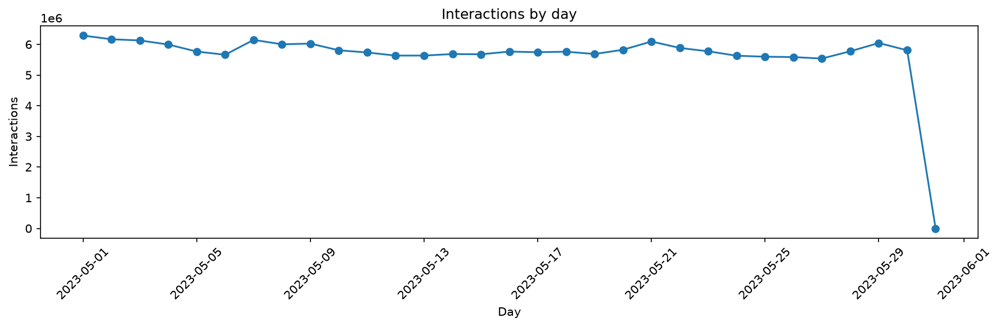

Ảnh: [images/09_daily_interactions.png](images/09_daily_interactions.png)

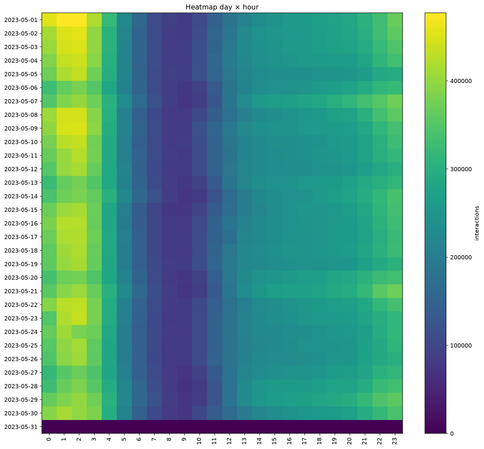

Ảnh: [images/09_day_hour_heatmap.png](images/09_day_hour_heatmap.png)

**Ghi chú thuyết trình:** Không kết luận nhu cầu thị trường sụt giảm vào 31/05. Không đổi giờ UTC thành giờ địa phương nếu chưa xác nhận.

**Nguồn:** `data/processed/eda_merrec_may/kernel_1752/tables/09_daily.csv`

---

## Slide 20 — EDA: mức độ quan tâm theo danh mục

**Phần:** 05 Exploratory Data Analysis

**Nội dung lên slide:**

- Women: 59.154.207 tương tác, khoảng 33,83% toàn bộ.
- Toys & Collectibles: 32.901.840; Men: 15.672.537.
- Category1 nổi bật gồm Shoes và Women’s handbags.
- Category phân cấp là nguồn đặc trưng cho nội dung và retrieval.

**Bố cục / hình:** Ảnh category0 chính; category1 là ảnh tùy chọn.

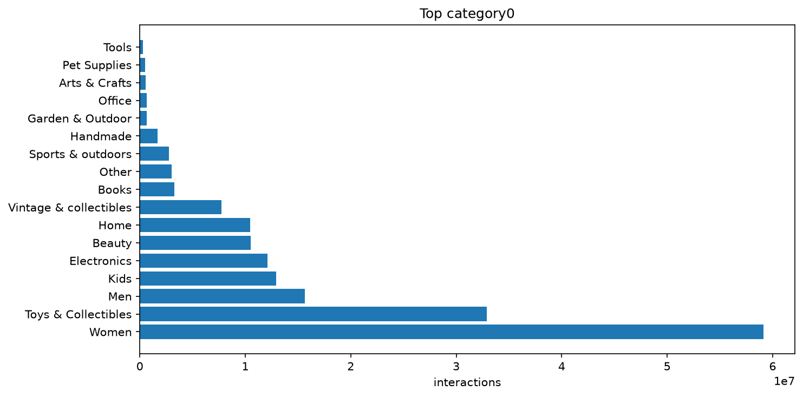

Ảnh: [images/10_top_category0.png](images/10_top_category0.png)

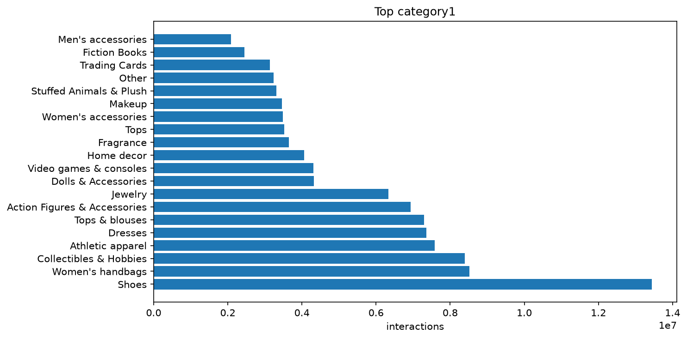

Ảnh: [images/10_top_category1.png](images/10_top_category1.png)

**Ghi chú thuyết trình:** Biểu đồ là số tương tác; không phải số item, số người mua hoặc thị phần.

**Nguồn:** `data/processed/eda_merrec_may/kernel_1752/tables/10_top_category0.csv`; `data/processed/eda_merrec_may/kernel_1752/tables/10_top_category1.csv`

---

## Slide 21 — EDA: phân bố giá lệch phải

**Phần:** 05 Exploratory Data Analysis

**Nội dung lên slide:**

- Giá trung bình 62,69; trung vị 25; P95=225; P99=636.
- Khoảng giá quan sát 1–5.000, theo đơn vị gốc của dataset.
- 11,51% dòng ngoài ngưỡng IQR; không đồng nghĩa đều là lỗi.
- Two-Tower dùng log(1+price), sau đó chuẩn hóa mean/std.

**Bố cục / hình:** Histogram log lớn; mean và median trong hai thẻ nhỏ.

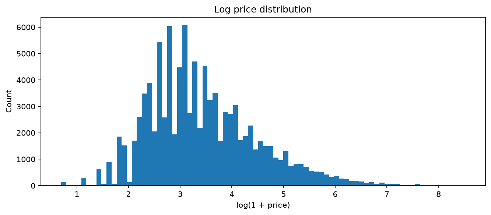

Ảnh: [images/11_price_log_hist.png](images/11_price_log_hist.png)

**Ghi chú thuyết trình:** Thống kê theo dòng tương tác, không phải item duy nhất. Không tự quy đổi tiền tệ.

**Nguồn:** `data/processed/eda_merrec_may/kernel_1752/tables/11_price_stats.csv`; `data/processed/eda_merrec_may/kernel_1752/tables/11_price_outliers.csv`; `training/models/05_two_tower.ipynb`

---

## Slide 22 — Từ EDA đến quyết định mô hình hóa

**Phần:** 05 Exploratory Data Analysis

**Nội dung lên slide:**

- 130.233.126 cặp user–item duy nhất; độ thưa 99,999843%.
- 25,53% phần tương tác là lặp thêm trên các cặp đã có.
- Dữ liệu thưa → thử implicit CF, metadata và chuỗi hành vi.
- One-pass 5-core loại 22,33% tương tác trong chẩn đoán.

**Bố cục / hình:** Bảng Phát hiện → Quyết định; ảnh k-core nhỏ hoặc dự phòng.

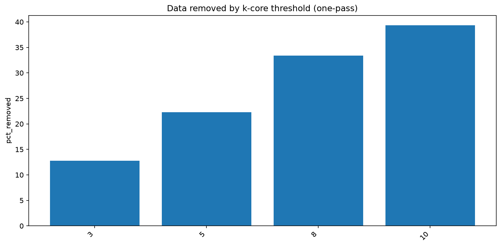

Ảnh: [images/12_k_core_removed.png](images/12_k_core_removed.png)

**Ghi chú thuyết trình:** One-pass k-core chưa phải thuật toán k-core lặp tới hội tụ và không phải bước lọc đã áp dụng trong preprocessing cuối.

**Nguồn:** `data/processed/eda_merrec_may/kernel_1752/tables/12_matrix_sparsity.csv`; `data/processed/eda_merrec_may/kernel_1752/tables/12_repeated_interactions.csv`; `data/processed/eda_merrec_may/kernel_1752/tables/12_k_core_one_pass.csv`

---

## Slide 23 — Implicit feedback có trọng số

**Phần:** 06 Feature Engineering

**Nội dung lên slide:**

- view=1; like=2; cart=4; offer=5; buy_start=7; buy_comp=10.
- implicit_score(u,i) = tổng trọng số sự kiện của cặp user–item.
- Lưu thêm số hành vi từng loại và thời điểm tương tác cuối.
- TRAIN tổng hợp thành 109.718.519 cặp user–item.

**Bố cục / hình:** Biểu đồ trọng số bên phải, công thức một dòng bên trái.

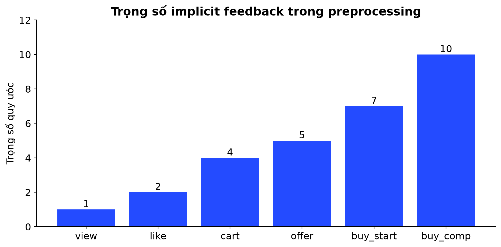

Ảnh: [images/s23_event_weights.png](images/s23_event_weights.png)

**Ghi chú thuyết trình:** Trọng số là cấu hình của dự án, không phải giá trị mô hình tự học.

**Nguồn:** `training/01_preprocess.ipynb`; `data/processed/recommender/tables/04_cf_train_summary.csv`

---

## Slide 24 — Biểu diễn nội dung và metadata

**Phần:** 06 Feature Engineering

**Nội dung lên slide:**

- Content-Based: Hashing TF-IDF 262.144 chiều, unigram và bigram.
- Văn bản: name, category0/1/2, brand, condition.
- Two-Tower: hash 7 trường metadata thành embedding, ghép price_z.
- Hashing và batch processing giúp kiểm soát bộ nhớ.

**Bố cục / hình:** Hai nhánh: văn bản → TF-IDF; metadata + giá → embedding/MLP.

**Ghi chú thuyết trình:** Content-Based dùng full metadata catalog; cần ghi rõ giới hạn đánh giá thời gian khi bàn kết quả.

**Nguồn:** `training/models/01_content_based.ipynb`; `training/models/05_two_tower.ipynb`

---

## Slide 25 — Chuỗi item và hành vi cho GRU4Rec

**Phần:** 06 Feature Engineering

**Nội dung lên slide:**

- Lịch sử được sắp theo thời gian; mỗi bước có item và loại hành vi.
- Item embedding 32 chiều; event embedding 16 chiều.
- Độ dài cấu hình tối đa 100; PAD=0, OOV=1.
- Nhãn là item tiếp theo; hành vi là feature đầu vào.

**Bố cục / hình:** Sơ đồ minh họa i₁/view → i₂/like → i₃/cart → dự đoán i₄.

**Ghi chú thuyết trình:** Chuỗi trên là ví dụ mô tả phương pháp, không phải dữ liệu thật của một người dùng.

**Nguồn:** `training/models/04_gru4rec.ipynb`; `artifacts/merrec_models/GRU4Rec/serving/gru4rec_config.json`

---

## Slide 26 — Các nhóm mô hình và phạm vi thực nghiệm

**Phần:** 07 Models

**Nội dung lên slide:**

- Baseline/fallback: Popularity, Trending; đã có snapshot.
- Theo nội dung/đồng xuất hiện: Content-Based, Co-visitation.
- Học biểu diễn: ALS, GRU4Rec, Two-Tower.
- Chưa có kết quả để báo cáo: SASRec, DCN, LightGBM Ranker.

**Bố cục / hình:** Sơ đồ ba nhóm phương pháp; nhóm chưa hoàn tất để ô riêng.

**Ghi chú thuyết trình:** Theo xác nhận người dùng, không đưa metric cũ của SASRec và không tạo kết quả cho DCN/LightGBM. Popularity/Trending không đưa vào bảng metric khi chưa có báo cáo tương ứng.

**Nguồn:** `training/models`; `artifacts/merrec_models`

---

## Slide 27 — Popularity và Trending

**Phần:** 07 Models

**Nội dung lên slide:**

- Popularity tổng hợp mức tương tác có trọng số theo item.
- Trending giảm ảnh hưởng sự kiện cũ với half-life 3 ngày.
- Điểm trending = Σ weight × 0,5^(tuổi sự kiện/3 ngày).
- Snapshot TRAIN dùng offline; snapshot processed toàn bộ phục vụ catalog/demo.

**Bố cục / hình:** Công thức lớn, sơ đồ giảm ảnh hưởng theo tuổi sự kiện.

**Ghi chú thuyết trình:** Không dùng snapshot toàn thời gian để báo cáo chất lượng dự đoán quá khứ.

**Nguồn:** `training/01_preprocess.ipynb`; `training/models/00_popularity_trending.ipynb`

---

## Slide 28 — Content-Based: gợi ý từ hồ sơ nội dung

**Phần:** 07 Models

**Nội dung lên slide:**

- Sản phẩm được biểu diễn bằng Hashing TF-IDF và các thành phần điểm trong notebook.
- Hồ sơ user dùng tối đa 100 item lịch sử, recency decay 0,97.
- So khớp vector chuẩn hóa; tìm qua các shard; lọc item đã xem.
- VAL dùng lịch sử TRAIN; TEST dùng lịch sử TRAIN+VAL.

**Bố cục / hình:** Metadata → vector item → hồ sơ user → cosine → Top-K.

**Ghi chú thuyết trình:** Catalog metadata và IDF dùng cả catalog đầy đủ, gồm các split. Không coi là benchmark thời gian nghiêm ngặt tương đương train-only metadata.

**Nguồn:** `training/models/01_content_based.ipynb`

---

## Slide 29 — Co-visitation: quan hệ đồng xuất hiện

**Phần:** 07 Models

**Nội dung lên slide:**

- Chia session bucket → tạo cặp sliding window → reduce Top-K.
- Best VAL: history_items=30, decay=0,9.
- reverse_weight=0,4; popularity_penalty=0,1; window=5; model_topk=250.
- Refit TRAIN+VAL sau tuning, rồi đánh giá TEST.

**Bố cục / hình:** Chuỗi item → cạnh đồng xuất hiện → danh sách láng giềng.

**Nguồn:** `training/models/02_covisitation.ipynb`; `training/checkpoints/covisitation/polars_v2/tuning/best_config.json`

---

## Slide 30 — ALS: collaborative filtering cho implicit data

**Phần:** 07 Models

**Nội dung lên slide:**

- Học vector ẩn user và item từ ma trận tương tác thưa.
- Artifact: factors=32, regularization=0,15, alpha=40, iterations=12.
- Chọn cấu hình bằng POSITIVE NDCG@20 trên VAL.
- Polars/PyArrow và CSR trên đĩa giúp kiểm soát bộ nhớ.

**Bố cục / hình:** Sơ đồ ma trận ≈ user factors × item factors và bảng tham số nhỏ.

**Nguồn:** `training/models/03_als.ipynb`; `artifacts/merrec_models/ALS/serving/als_config.json`

---

## Slide 31 — GRU4Rec: học thứ tự và loại hành vi

**Phần:** 07 Models

**Nội dung lên slide:**

- Ghép item/event embedding → GRU 2 lớp, hidden_dim=128.
- Dự đoán item tiếp theo với sampled softmax; cấu hình train 64 negatives.
- Item embedding đặt CPU; GRU/dense được thiết kế chạy GPU.
- Metric đang có là sampled validation, không phải full-catalog TEST.

**Bố cục / hình:** Sơ đồ item + event → GRU → ngữ cảnh → chấm điểm.

**Ghi chú thuyết trình:** Catalog TRAIN đầy đủ không có nghĩa metric được đo trên toàn catalog. Không khẳng định index đã tồn tại chỉ từ serving config.

**Nguồn:** `training/models/04_gru4rec.ipynb`; `artifacts/merrec_models/GRU4Rec/metrics/train_history.json`

---

## Slide 32 — Two-Tower: biểu diễn user và item

**Phần:** 07 Models

**Nội dung lên slide:**

- User tower: user embedding 64 chiều.
- Item tower: 7 metadata embedding ×16 chiều + price_z → MLP 256 → 64.
- Chuẩn hóa vector; in-batch negatives và symmetric InfoNCE.
- Summary ghi FAISS index chứa 27.328.461 TRAIN item.

**Bố cục / hình:** Sơ đồ hai tháp hội tụ tại tích vô hướng; FAISS sau item tower.

**Ghi chú thuyết trình:** Không suy ra website đã phục vụ bằng model này. Cold-user fallback là vấn đề cần tích hợp/kiểm chứng.

**Nguồn:** `training/models/05_two_tower.ipynb`; `artifacts/merrec_models/TwoTower/serving/twotower_config.json`; `artifacts/merrec_models/TwoTower/metrics/summary.json`

---

## Slide 33 — Thiết lập huấn luyện

**Phần:** 08 Model Training

**Nội dung lên slide:**

- ALS: 32 factors, 12 iterations; chọn theo POSITIVE NDCG@20.
- GRU4Rec: batch=128, tối đa 1 triệu windows/epoch; history có 8 epoch.
- Two-Tower: batch=2.048; history có 15 epoch; best ở epoch 15.
- Đọc theo batch/row-group, lưu checkpoint và hỗ trợ resume.

**Bố cục / hình:** Bảng ba mô hình: batch/quy mô, số vòng, tiêu chí lựa chọn.

**Ghi chú thuyết trình:** Không tự nêu GPU, thời gian toàn bộ training hoặc số epoch full-pass chưa xác minh. GRU bị giới hạn windows mỗi epoch.

**Nguồn:** `training/models/04_gru4rec.ipynb`; `artifacts/merrec_models/TwoTower/serving/twotower_config.json`; `artifacts/merrec_models/ALS/serving/als_config.json`

---

## Slide 34 — Theo dõi loss và chọn checkpoint

**Phần:** 08 Model Training

**Nội dung lên slide:**

- GRU4Rec: train loss 3,994 → 3,886 trong 8 epoch đã lưu.
- Two-Tower: train loss 6,854 → 4,441 trong 15 epoch đã lưu.
- GRU chọn epoch 6 theo sampled VAL Recall@20.
- Two-Tower chọn epoch 15 theo POSITIVE NDCG@20 trên pool validation.

**Bố cục / hình:** Hai đồ thị loss riêng biệt.

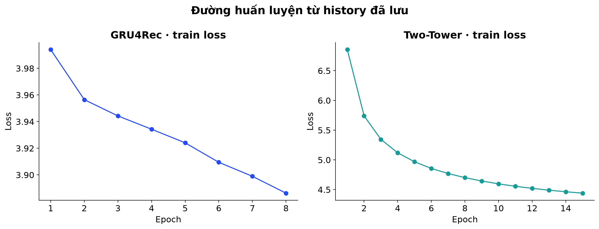

Ảnh: [images/s34_training_loss.png](images/s34_training_loss.png)

**Ghi chú thuyết trình:** Hai loss có mục tiêu khác nhau; chỉ đọc xu hướng riêng, không so trị số loss để chọn mô hình.

**Nguồn:** `artifacts/merrec_models/GRU4Rec/metrics/train_history.json`; `artifacts/merrec_models/TwoTower/metrics/train_history.json`

---

## Slide 35 — Đọc đúng giao thức đánh giá

**Phần:** 09 Results

**Nội dung lên slide:**

- Recall đo phần target tìm thấy; HitRate đo có hit; NDCG xét vị trí.
- Phải ghi split, nhóm target, số user, candidate universe và seen-item filtering.
- Two-Tower VAL POSITIVE NDCG@20: 0,023326 trên pool chọn checkpoint; 0,000826 trên full-index.
- GRU4Rec dùng 1 target + 255 negatives, không so trực tiếp với full-index.

**Bố cục / hình:** Biểu đồ hai giao thức Two-Tower và hộp định nghĩa metric.

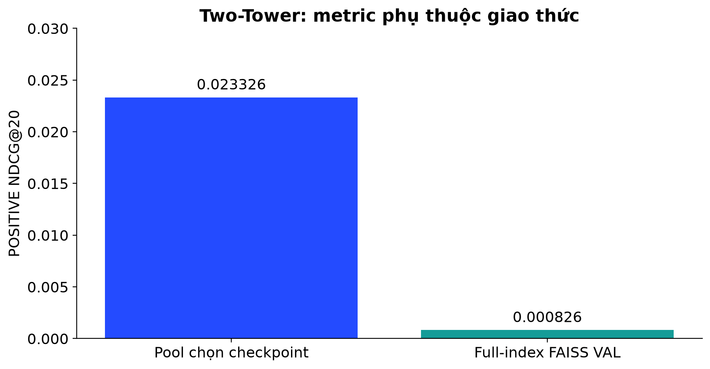

Ảnh: [images/s35_twotower_protocols.png](images/s35_twotower_protocols.png)

**Ghi chú thuyết trình:** Không quy toàn bộ chênh lệch cho FAISS. Muốn xếp hạng các mô hình phải thống nhất protocol.

**Nguồn:** `artifacts/merrec_models/TwoTower/metrics/train_history.json`; `artifacts/merrec_models/TwoTower/metrics/val_full_index_metrics.json`; `artifacts/merrec_models/GRU4Rec/metrics/train_history.json`

---

## Slide 36 — Kết quả TEST hiện có — từng thực nghiệm riêng

**Phần:** 09 Results

**Nội dung lên slide:**

- Content-Based / POSITIVE: Recall@20=1,2514%; NDCG@20=0,004429.
- Co-visitation / POSITIVE: Recall@20=1,2245%; NDCG@20=0,006931.
- ALS / POSITIVE: Recall@20=0,1122%; NDCG@20=0,000347.
- Two-Tower full-index / POSITIVE: Recall@20=0,0729%; NDCG@20=0,000263.

**Bố cục / hình:** Bảng chiếm 70%; giữ dòng 'Khác giao thức và mẫu user; không phải leaderboard'.

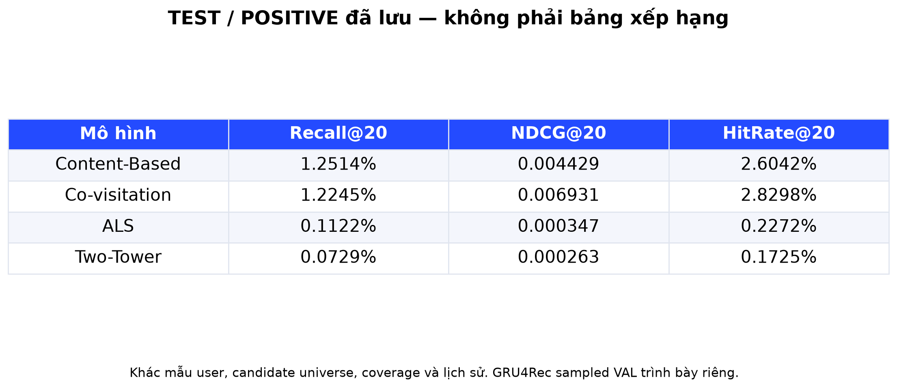

Ảnh: [images/s36_results_table.png](images/s36_results_table.png)

**Ghi chú thuyết trình:** Content-Based có 192 user POSITIVE, Co-visitation 2.191, ALS 2.201. Two-Tower dùng mẫu TEST cấu hình 5.000 user trước lọc. Khác tập user, coverage, candidate universe và pipeline target; không kết luận mô hình thắng chung.

**Nguồn:** `training/checkpoints/content_based_full_catalog/evaluation_test.csv`; `training/checkpoints/covisitation/polars_v2/results/test_metrics.csv`; `artifacts/merrec_models/ALS/metrics/test_metrics.csv`; `artifacts/merrec_models/TwoTower/metrics/test_full_index_metrics.json`

---

## Slide 37 — Kết quả GRU4Rec và bài học đánh giá

**Phần:** 09 Results

**Nội dung lên slide:**

- Best sampled validation Recall@20=15,69% tại epoch 6.
- 1.810 user được đánh giá; mỗi target xếp cùng 255 sampled negatives.
- Đây chưa phải metric full-index TEST hoặc chất lượng online.
- Bước tiếp theo: thống nhất cohort/candidates và đánh giá full-index.

**Bố cục / hình:** Đường Recall@20 lớn; nhãn SAMPLED VALIDATION rõ ràng.

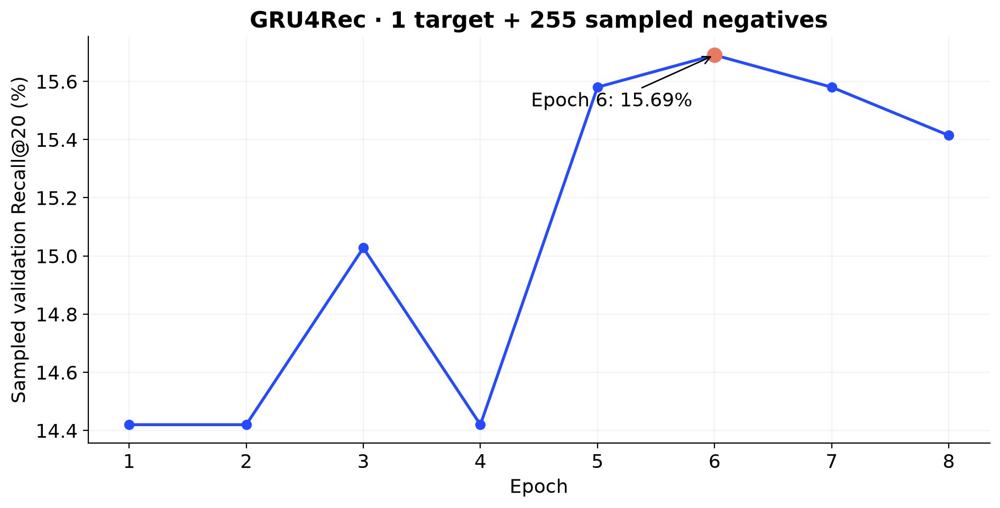

Ảnh: [images/s37_gru_sampled_recall.png](images/s37_gru_sampled_recall.png)

**Nguồn:** `artifacts/merrec_models/GRU4Rec/metrics/summary.json`; `artifacts/merrec_models/GRU4Rec/metrics/train_history.json`

---

## Slide 38 — Kết luận và hướng phát triển

**Phần:** 11 Conclusion

**Nội dung lên slide:**

- Đã có EDA và preprocessing cho 174,87 triệu sự kiện.
- Long-tail, cold-item và quy mô catalog là vấn đề nổi bật.
- Đã có kết quả riêng của Content-Based, Co-visitation, ALS, Two-Tower và sampled VAL của GRU4Rec.
- Tiếp tục: thống nhất đánh giá; hoàn thiện SASRec/DCN/LightGBM; tích hợp và đo chất lượng phục vụ.

**Bố cục / hình:** Ba cột Đã thực hiện · Điều rút ra · Bước tiếp theo; kết thúc phần chính.

**Ghi chú thuyết trình:** Không sử dụng metric SASRec cũ. Offline metrics không chứng minh tăng doanh thu hoặc production readiness.

**Nguồn:** `training/01_preprocess.ipynb`; `training/checkpoints`; `artifacts/merrec_models`

---

## Slide 39 — Demo MerRec — trình bày riêng

**Phần:** 10 Web Application — Phụ lục

**Nội dung lên slide:**

- Minh họa: khám phá sản phẩm → chi tiết → khu vực gợi ý.
- Demo khoảng 30–60 giây hoặc chuyển trực tiếp sang website.
- Ghi nhãn thuật toán đúng với phiên bản backend thực tế.

**Bố cục / hình:** Khung [CHÈN ẢNH TRANG CHỦ THỰC TẾ] chiếm 75%; không tạo giao diện giả.

**Ghi chú thuyết trình:** Chưa chụp/kiểm chứng website trong công việc tạo tài liệu này. Không khẳng định model offline đã được nối vào website.

---

## Slide 40 — Ảnh demo và thảo luận

**Phần:** 10 Web Application — Phụ lục

**Nội dung lên slide:**

- Một ảnh trang chi tiết sản phẩm với khu vực gợi ý.
- Một ảnh luồng tiếp theo tùy chọn; không trình bày sâu kỹ thuật web.
- Cảm ơn và Q&A.

**Bố cục / hình:** Hai khung [ẢNH CHI TIẾT SẢN PHẨM] và [ẢNH DEMO TÙY CHỌN].

**Ghi chú thuyết trình:** Hai trang demo tách riêng, không chen vào 38 slide nghiên cứu.

---

